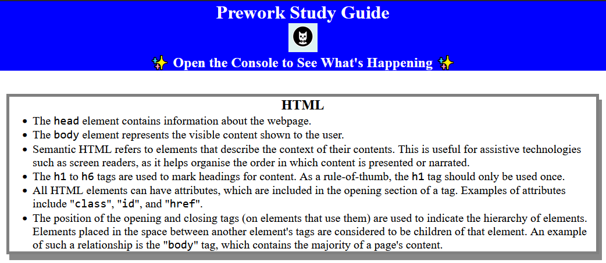
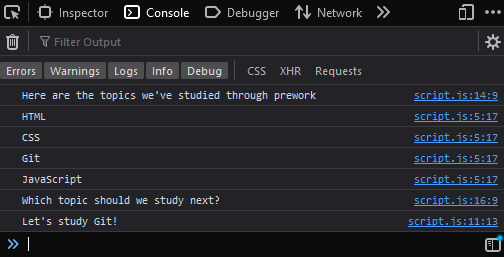

# <Your-Project-Title>

## Description

This site acts as a sample of a study guide created utilising HTML, CSS, and JavaScript, while incorporating the Github Flow. It was created as part of prework for the University of Sydney's Coding Bootcamp program.

The skills that were utilised for the creation of this site include:
- Creating a repository both locally and in Github
- Creating, navigating, and deleting branches
- Staging and committing changes
- Synchronising state (push/pull) between the local and remote repository
- Creating, reviewing, and approving pull requests into the main repository
- Basic HTML, including
    - General structure of webpages
    - The `<head>` tag
    - The `<body>` tag, and an introduction to semantic HTML such as `<main>` and `<section>`
    - An introduction to attributes such as `class` and `href`
- Basic CSS
    - Creating a stylesheet
    - Adding the stylesheet to a webpage using the `<link>` tag
    - Attributes and selectors
    - Selecting multiple attributes
    - Using classes
    - Introduction to the Box Model
- Basic JavaScript
    - Creating a script
    - Adding the script to a webpage using `<script>` tags
    - Variables
    - Functions
    - Flow controls (`if...else`, `for`)
    - Arrays and iterators
    - Developer Tools
    - The Console

## Usage

The notes on the page are presented in four distinct groups that you can review in any order you wish. A complete screenshot of the page is also present

If you need help choosing a topic, you can press `F12` to bring up Developer Tools and see a suggestion at random in the console.

## License

This project is licensed under the MIT License as below.

Copyright (c) 2023 Nat Poulson

Permission is hereby granted, free of charge, to any person obtaining a copy
of this software and associated documentation files (the "Software"), to deal
in the Software without restriction, including without limitation the rights
to use, copy, modify, merge, publish, distribute, sublicense, and/or sell
copies of the Software, and to permit persons to whom the Software is
furnished to do so, subject to the following conditions:

The above copyright notice and this permission notice shall be included in all
copies or substantial portions of the Software.

THE SOFTWARE IS PROVIDED "AS IS", WITHOUT WARRANTY OF ANY KIND, EXPRESS OR
IMPLIED, INCLUDING BUT NOT LIMITED TO THE WARRANTIES OF MERCHANTABILITY,
FITNESS FOR A PARTICULAR PURPOSE AND NONINFRINGEMENT. IN NO EVENT SHALL THE
AUTHORS OR COPYRIGHT HOLDERS BE LIABLE FOR ANY CLAIM, DAMAGES OR OTHER
LIABILITY, WHETHER IN AN ACTION OF CONTRACT, TORT OR OTHERWISE, ARISING FROM,
OUT OF OR IN CONNECTION WITH THE SOFTWARE OR THE USE OR OTHER DEALINGS IN THE
SOFTWARE.
